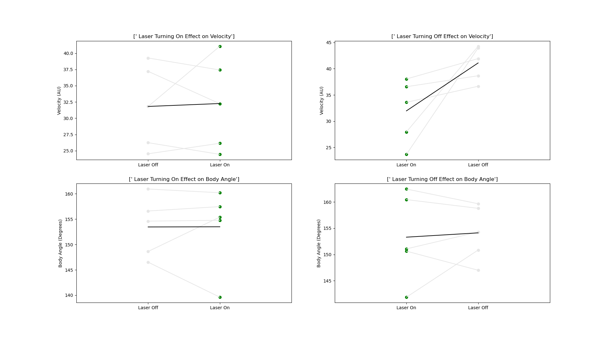

# DeepLabCut-MovementAnalysis
 
Python script for cleaning deeplabcut data and analyzing movement behaviors
throughout a session.

# Example output
 
 

We are conducting analysis to see how behaviors change around windows of
optogentic manipulation. We are analyzing for effects as a laser turns on
(on_pre -> on_post) and for effects as a laser turns off (off_pre -> off_post).

Velocity and body angle are determined using deeplabcut coordinate data.

In deepLabCut_FiltLaser.py, I am using a 0.5 second window around the laser
turning on and off for this analysis. I did this because my laser duration is
1.5 seconds. If your laser time is much shorter, this window might be too long.
See line 200 for a possible change point for your data

Also note that the data here are specific for tracking 3 points (nose, body, 
and tail) and these are the minimal points for tracking body angle of a mouse.
Sample data taken from open field sessions that are not comparable (bilateral
vs unilateral). For unilateral laser manipulations, side of manipulation 
potentially biasing turns in one direction should not matter because the method
of measuring body angle is agnostic to which direction the animal turns.

Run laserAnalyze.py to coanalyze multiple animals' data. Be sure to change 
individual variables (fps, num events, nAnimals) for your specific project.

When running this code, two pop up windows will appear to prompt a file input
for each animal. The first input should be the coordinate data as a csv output
from deeplabcut. The second input is a matlab matrix. Each row of the matlab
matrix represents a distinct laser event. The first column of each row is the
time that the laser turns on & the second column is the time that the laser
turns off. You can use a different method for loading laser times to suit your
own needs, if needed.